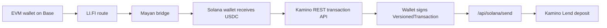

# NestFlow

Cross-chain savings flow for moving funds from EVM chains into Solana DeFi.

Live demo: [https://www.nestflow.host](https://www.nestflow.host)

Built for [Build with LI.FI: Superteam Germany](https://superteam.fun/earn/listing/build-with-lifi-superteam-germany).

## What It Does

NestFlow helps a user move funds from an EVM chain to Solana and deposit the received USDC into Kamino Lend.

The confirmed live demo flow is:

1. Bridge/swap from Base through LI.FI and Mayan.
2. Receive USDC on Solana.
3. Deposit USDC into Kamino Lend.

## Why It Matters

Cross-chain DeFi savings is still too fragmented. A user normally needs to open multiple apps, move assets across chains, wait for settlement, then manually deposit into a Solana yield protocol.

NestFlow turns that into one guided flow with explicit status tracking and retry support for the final Solana deposit step.

## Live Proof

End-to-end mainnet flow has been confirmed:

- Base LI.FI/Mayan transaction: [0x20a8886a6109c0036a79b08b2282331bf0d87b4a7718e4d6ef3713c06f404857](https://basescan.org/tx/0x20a8886a6109c0036a79b08b2282331bf0d87b4a7718e4d6ef3713c06f404857)
- Solana Mayan settle / receive USDC transaction: [DD9RWAsk3qTwTm6xz56foBFD9LqMc8VY2AnVmX56Mh1qagXnh1ffo5hsWMxLE1xztBaHskAVVLitXqRoeCK9BhL](https://solscan.io/tx/DD9RWAsk3qTwTm6xz56foBFD9LqMc8VY2AnVmX56Mh1qagXnh1ffo5hsWMxLE1xztBaHskAVVLitXqRoeCK9BhL)
- Kamino deposit transaction: [526ACoonsTBWctAt9YdCN2Z8GUaDoKybiC7HDyKoZ79PKhX7wk7u8d1M6U8R93bRRufUEAd2uAUhtX5rZZLFWorp](https://solscan.io/tx/526ACoonsTBWctAt9YdCN2Z8GUaDoKybiC7HDyKoZ79PKhX7wk7u8d1M6U8R93bRRufUEAd2uAUhtX5rZZLFWorp)

More detail: [docs/demo-proof.md](docs/demo-proof.md)

## Architecture



## Tech Stack

- Next.js 15
- TypeScript
- Tailwind CSS
- wagmi + RainbowKit for EVM wallets
- Solana wallet adapter for Phantom and Solflare
- LI.FI SDK/API
- Kamino official REST transaction API
- Vercel

## Key Routes

- `app/api/lifi/route.ts` - LI.FI route handling.
- `app/api/kamino/deposit/route.ts` - creates an unsigned Kamino deposit transaction through the official Kamino REST API.
- `app/api/solana/send/route.ts` - submits a signed Solana transaction server-side and polls confirmation.

## Environment

Production requires:

```env
LIFI_API_KEY=...
SOLANA_RPC=...
```

`SOLANA_RPC` must be server-side only. Do not expose it as `NEXT_PUBLIC_SOLANA_RPC`.

## Local Development

```bash
npm install
npm run dev
```

Open [http://localhost:3000](http://localhost:3000).

## Checks

```bash
npm run lint
npx tsc --noEmit
npm run build
```

Known build warning:

- `viem/ox` via `@lifi/sdk`: `Critical dependency: the request of a dependency is an expression`

The warning is currently non-blocking and the production build passes.

## Deployment

Production:

- [https://www.nestflow.host](https://www.nestflow.host)
- [https://nestflow.host](https://nestflow.host) redirects to `www`

Vercel project: `nest-flow`

## Team

Oleksandr / teremno

GitHub: [@teremno](https://github.com/teremno)
