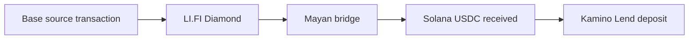

# NestFlow Demo Proof

This note records the confirmed mainnet demo flow for the Build with LI.FI: Superteam Germany hackathon.

Live app: [https://www.nestflow.host](https://www.nestflow.host)

## Confirmed Flow

## Transactions

### 1. Base LI.FI / Mayan Bridge

- Explorer: [BaseScan](https://basescan.org/tx/0x20a8886a6109c0036a79b08b2282331bf0d87b4a7718e4d6ef3713c06f404857)
- Transaction: `0x20a8886a6109c0036a79b08b2282331bf0d87b4a7718e4d6ef3713c06f404857`
- Status: `Success`
- Action: swap and start bridge through `LI.FI: LiFi Diamond` and Mayan.

### 2. Solana USDC Receive / Mayan Settle

- Explorer: [Solscan](https://solscan.io/tx/DD9RWAsk3qTwTm6xz56foBFD9LqMc8VY2AnVmX56Mh1qagXnh1ffo5hsWMxLE1xztBaHskAVVLitXqRoeCK9BhL)
- Transaction: `DD9RWAsk3qTwTm6xz56foBFD9LqMc8VY2AnVmX56Mh1qagXnh1ffo5hsWMxLE1xztBaHskAVVLitXqRoeCK9BhL`
- RPC status: `err: null`
- Program: Mayan
- Instruction: `Settle`
- Result: USDC received on Solana.

### 3. Kamino Deposit

- Explorer: [Solscan](https://solscan.io/tx/526ACoonsTBWctAt9YdCN2Z8GUaDoKybiC7HDyKoZ79PKhX7wk7u8d1M6U8R93bRRufUEAd2uAUhtX5rZZLFWorp)
- Transaction: `526ACoonsTBWctAt9YdCN2Z8GUaDoKybiC7HDyKoZ79PKhX7wk7u8d1M6U8R93bRRufUEAd2uAUhtX5rZZLFWorp`
- RPC status: `err: null`
- Program: `KLend2g3cP87fffoy8q1mQqGKjrxjC8boSyAYavgmjD`
- Instruction: `DepositReserveLiquidityAndObligationCollateralV2`
- Reserve: `D6q6wuQSrifJKZYpR1M8R4YawnLDtDsMmWM1NbBmgJ59`
- Amount: `2290254` USDC base units
- Result: Kamino deposit confirmed.

## Validation Notes

- LI.FI bridge/swap is live-confirmed on BaseScan.
- Solana receive is live-confirmed on Solscan.
- Kamino deposit is live-confirmed on Solscan and through Solana RPC logs.
- The app UI shows all three steps as done: Bridge, Receive USDC, Kamino Deposit.

## Demo Rule

If a previous bridge has already completed and USDC is already on Solana, do not repeat the full bridge flow. Use only the Kamino deposit retry path.
